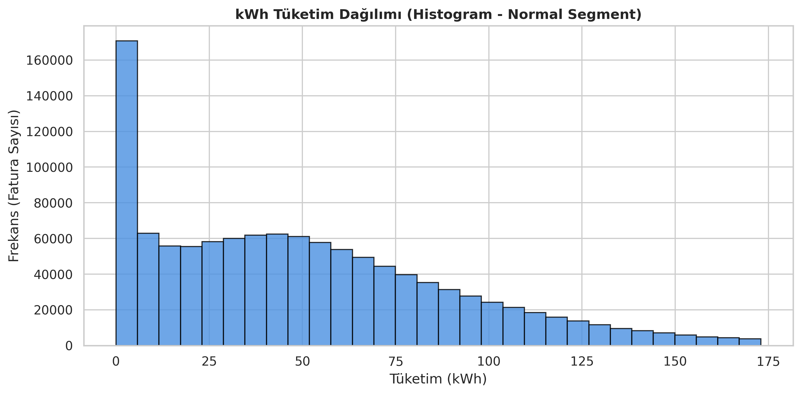
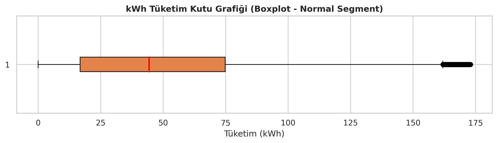
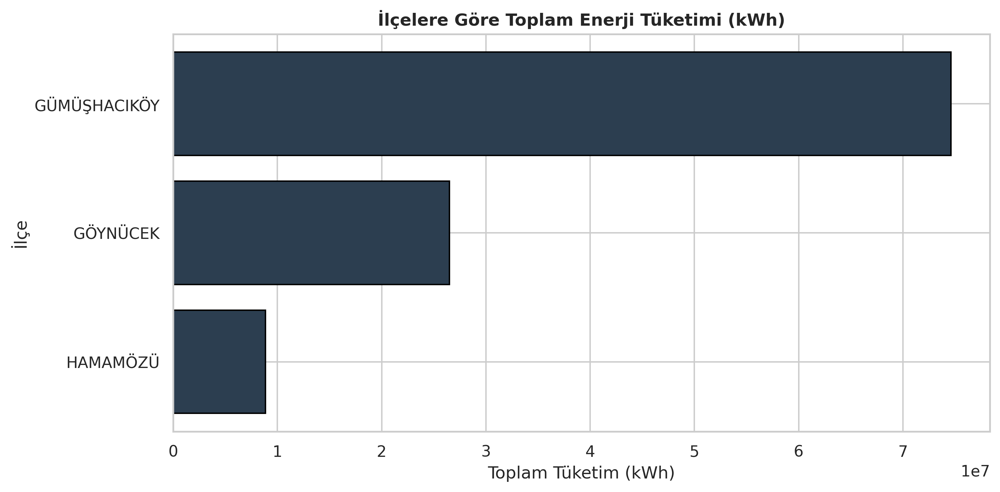
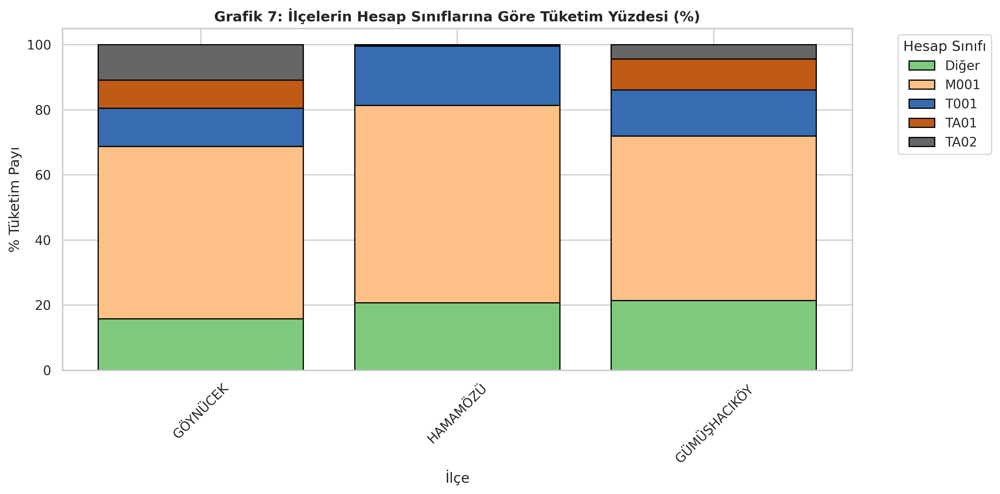
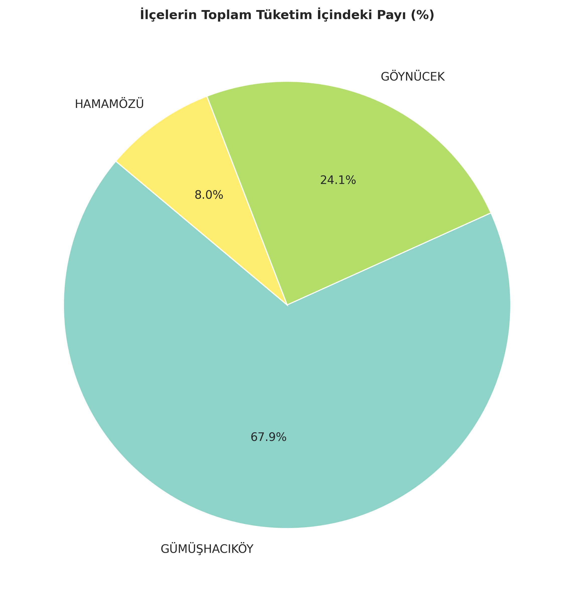

# ⚡ ACV Energy Case Study 02

## 📌 Proje Hakkında


Çalışmada elektrik tüketim ve tahsilat verileri Python kullanılarak analiz edilmiş, veri kalitesi incelenmiş, görselleştirmeler oluşturulmuş, müşteri segmentasyonu gerçekleştirilmiş ve elde edilen bulgular iş içgörülerine dönüştürülmüştür.

---

# 📂 Proje Yapısı

```
ACV-ENERGY-case-study-02
│
├── README.md
├── requirements.txt
│
├── notebooks
│   ├── notebook_01_veri_kesfi.ipynb
│   ├── notebook_02_gorsellestirme.ipynb
│   └── notebook_03_veri_hikayesi.ipynb
│
├── notebook1_outputs
├── notebook2_outputs
└── notebook3_outputs
```

---

# 📚 Notebook İçerikleri

## 📒 Notebook 01 – Veri Keşfi ve Veri Kalitesi

Bu notebookta;

- Veri dosyaları okunmuştur.
- Sütun isimleri standartlaştırılmıştır.
- Veri tipleri düzenlenmiştir.
- Eksik değer analizi yapılmıştır.
- Mükerrer kayıtlar incelenmiştir.
- Negatif ve aykırı tüketimler analiz edilmiştir.
- Temiz veri setleri oluşturulmuştur.
- İstatistiksel özet raporları hazırlanmıştır.

---

## 📒 Notebook 02 – Görselleştirme ve Keşifsel Veri Analizi

Bu notebookta;

- Tüketim dağılımları incelenmiştir.
- Histogram, Boxplot, KDE ve ECDF grafikleri oluşturulmuştur.
- İlçeler karşılaştırılmıştır.
- Hesap sınıfları analiz edilmiştir.
- Aylık tüketim eğilimleri incelenmiştir.
- Karşılaştırmalı grafikler hazırlanmıştır.
- Kurumsal rapor tabloları oluşturulmuştur.

---

## 📒 Notebook 03 – Veri Hikâyesi ve İş Analizi

Bu notebookta;

- İlçeler arasındaki tüketim farklılıkları yorumlanmıştır.
- Müşteri davranışları analiz edilmiştir.
- Risk skoru oluşturulmuştur.
- Müşteri segmentasyonu yapılmıştır.
- Yönetici özeti hazırlanmıştır.
- Stratejik iş önerileri sunulmuştur.

---

# 📊 Kullanılan Teknolojiler

- Python
- Pandas
- NumPy
- Matplotlib
- Seaborn
- OpenPyXL
- Jupyter Notebook

---

# 📁 Veri Seti

Case Study kapsamında paylaşılan orijinal veri dosyaları (`veri_1.csv` – `veri_5.csv`) organizatörlerin yönlendirmesi doğrultusunda GitHub deposuna eklenmemiştir.

Notebookların geliştirilmesi sırasında çalışma kolaylığı sağlamak amacıyla veri dosyaları ayrı CSV dosyaları halinde kullanılmıştır.

Bu nedenle GitHub deposunda yalnızca notebooklar, analiz çıktıları ve oluşturulan raporlar paylaşılmıştır.

---

## 📁 Büyük Çıktı Dosyaları Hakkında

Notebook 01 çalıştırıldığında aşağıdaki ara veri dosyaları otomatik olarak oluşturulmaktadır:

- `temizlenmis_veri.csv`
- `pozitif_tuketim_verisi.csv`
- `tahakkuk_isaretli_tam_veri.csv`

Bu dosyalar, orijinal veri setinin işlenmiş türevlerini içermektedir.

Dosya boyutlarının büyük olması ve GitHub yükleme sınırları nedeniyle bu dosyalar depoya eklenmemiştir.

Notebooklar çalıştırıldığında ilgili dosyalar otomatik olarak yeniden oluşturulmaktadır.

---

# 💻 Çalıştırma Ortamı

Notebooklar Windows işletim sistemi üzerinde geliştirilmiş ve test edilmiştir.

Kod içerisinde kullanılan dosya yolları geliştirme ortamına aittir.

Örneğin;

```text
C:\Users\...\Downloads\veri_1.csv
```

Projeyi farklı bir bilgisayarda çalıştıracak kullanıcıların notebooklarda bulunan dosya yollarını kendi ortamlarına göre güncellemeleri gerekmektedir.

---

# 📦 Kurulum

Gerekli Python paketlerini yüklemek için:

```bash
pip install -r requirements.txt
```

---

# 📈 Üretilen Çıktılar

Proje kapsamında aşağıdaki çıktılar oluşturulmuştur.

- Temizlenmiş veri setleri
- İstatistiksel özet raporları
- İlçe bazlı analizler
- Görselleştirmeler
- Müşteri segmentasyonu
- Risk analizleri
- Excel raporları
- Stratejik iş önerileri

Çıktılar notebook bazında aşağıdaki klasörlerde paylaşılmıştır:

- `notebook1_outputs`
- `notebook2_outputs`
- `notebook3_outputs`

---

# 📊 Örnek Çıktılar

## 1. Tüketim Histogramı



---

## 2. Tüketim Boxplot



---

## 3. İlçelere Göre Toplam Tüketim



---

## 4. Hesap Sınıfı Dağılımı



---

## 5. İlçelerin Toplam Tüketim Payı



---

# 🎯 Stratejik Öneriler

Analiz sonuçlarına dayanarak aşağıdaki stratejik aksiyonlar önerilmektedir.

## 1. Yüksek Değerli Müşteri Yönetimi

- Yüksek tahakkuk tutarına ve düzenli ödeme davranışına sahip müşteriler için sadakat programları geliştirilebilir.
- Otomatik ödeme kullanımını artırmaya yönelik kampanyalar planlanabilir.
- Dijital fatura ve kişiselleştirilmiş müşteri hizmetleri sunulabilir.

## 2. Tahsilat Riskinin Azaltılması

- Yüksek değerli ancak gecikmeli ödeme yapan müşteriler öncelikli takip listesine alınabilir.
- Erken uyarı, otomatik hatırlatma ve ödeme planı seçenekleri uygulanabilir.
- Tahsilat ekipleri değer ve risk skoruna göre önceliklendirilebilir.

## 3. Bölgesel Operasyon Planlaması

- İlçeler arasındaki tüketim farklılıkları müşteri sayısı, hesap sınıfı dağılımı ve mevsimsellik ile birlikte değerlendirilmelidir.
- Tüketimin belirli dönemlerde arttığı bölgelerde operasyon ve bakım planlamaları buna göre yapılabilir.

## 4. Müşteri Segmentlerine Göre İletişim

- Düzenli ödeme yapan müşteriler için dijital iletişim kanalları güçlendirilebilir.
- Riskli müşteri grupları için SMS, e-posta ve ödeme hatırlatma süreçleri otomatikleştirilebilir.

## 5. Veri Kalitesi ve İzleme

- Negatif tüketim kayıtları düzenli olarak kontrol edilmelidir.
- Mükerrer ve aykırı kayıtlar için doğrulama mekanizmaları oluşturulmalıdır.
- Risk ve değer skorları belirli aralıklarla güncellenerek müşteri davranışındaki değişimler izlenmelidir.

---

# 📝 Not

Bu çalışma **ACV Energy Case Study 02** kapsamında hazırlanmıştır.

Orijinal veri dosyaları organizatörlerin paylaşım kuralları ve dosya boyutları nedeniyle GitHub deposuna eklenmemiştir.

---

# 👩‍💻 Geliştirici

**Hatice Gül Uzun**

ACV Energy Case Study 02

Python • Pandas • NumPy • Matplotlib • Seaborn
